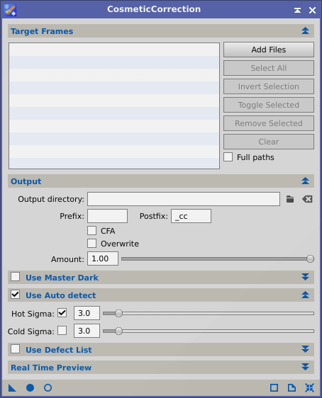
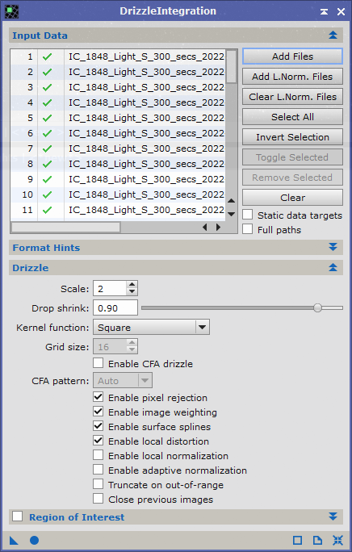

# PixInsight processing

I do all my post processing in Pixinsight.
I find it rather easy to have only one tool to do all the stuuf. So I invested some time trying to learning it.

This page won't explain all decision choicies. This page aims as a remainder for me ;)

In order to ease my workflow, i use a specific directory layout at each start :

```
2022-09 - IC1848 - Heart and soul nebulae
 ┣ Bias
 ┣ Dark
 ┣ Flat
 ┃ ┣ Ha
 ┃ ┣ Oiii
 ┃ ┗ Sii
 ┣ Light
 ┃ ┣ Ha
 ┃ ┣ Oiii
 ┃ ┗ Sii
 ┗ Light - orig
 ┃ ┣ Ha
 ┃ ┣ Oiii
 ┃ ┗ Sii
 ```

Directory structure is self explainatory. The only thing i am doing is to use a `Light - orig` folder containg all raws images in order to keep a copy of everything.
`Light` directory is, at the beginning of the process, empty and will be filled in the next section during `image selection`

## Image selection - Blink

> Can be found under `PROCESS -> XXX -> Blink`

The first step of processing is choosing the right frames to include for registration and stacking.
To do i use the `blink` process which permits me to select my subframes.
I go through all my `Light - orig` directories with the blink tool to move them in the `Light` directory in the correct folder.

I am doing it this band per band to ease the review.

## Cosmetic correction process creation

Can be found under `PROCESS -> ImageCalibration -> CosmeticCorrection`

The goal here is to create a process which will be used during WBPP. You can configure a process as show in the screen shot and the create an instance on the desktop. Do not launch it, it will be used during image integration.

 

## Image integration - Weighted Batch preprocessing

> Can be found under `Script -> XXXX -> WeightedBatchPreprocessing`

- Enable drizzle data on light frames

## DrizzleIntegration 

> Can be found under `PROCESS -> Image Integration -> DrizzleIntegratrion`

For each master files produced by the integration, you can integrate drizzle data if :
- the images are undersampled
- you made some dithering during pictures

To configure the process, you have to configure accordingly the process by addding all `.xdrz` files that have been produced during the integration (they should be located under `<your pixinsight working directory>/registered`) :

 

 To launch the process click on the round button to apply the process.

 Ho, and get grab a coffee ;) 

## Crop 

> Can be found under `PROCESS -> Geometry -> Crop`

 It's time to crop to keep only the nice/interesting area !

## Background Extraction

## Deconvolution

## Denoise

Use EZ-denoised
